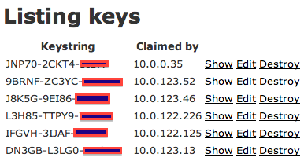
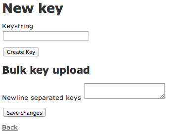
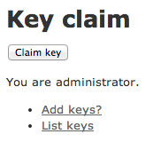
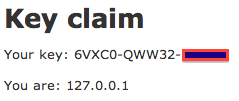

Game Key Tool
=============

by Colin Dean <cdean@pittco.org>

© 2013 Colin Dean. See [LICENSING](LICENSING.md) for more details.

Introduction
------------

GKT facilitates effortless distribution of game keys for gaming events. It is very simple to set up, and even simpler to use.

Features
--------

* Single key upload
* Bulk key upload
* One-click key claim process
* Claimants tracked by IP address, with timestamp
* Simple edit of keys for mistakes or to clear a claim
* Easy deletion of keys
* Security:
  * Only a user from localhost may upload, edit, or delete keys
  * User assigned key only once per IP, limiting number of keys a single user can claim
    
### Planned features

See [Github Issues: open
enhancements](https://github.com/pittco/gamekeytool/issues?labels=enhancement&state=open)
for planned features.

### Screenshots

Keys partially obscured for obvious reasons.

Use/Workflow
------------

1. Download source from Github or wherever.
2. Execute some commands:

        RAILS_ENV=production bundle install
        RAILS_ENV=production rake db:migrate
        RAILS_ENV=production rails server

3. Visit http://localhost:3000/keys to upload key(s).
4. Direct users to http://localhost:3000 to claim their key.

The intent is to keep installation as smooth as possible.

Known real-world uses
---------------------

* [The GXL Resurrection 2013](http://www.thegxl.com) LAN party, 11-13 October 2013. 350 attendees, ~75 users of GKT.

Edit this file and submit a pull request, or file an issue, if you want to add your event to this list.

Licensing
---------

See [LICENSING](LICENSING.md) for more details.

Contributing
------------

See [CONTRIBUTING](CONTRIBUTING.md) for more details.
